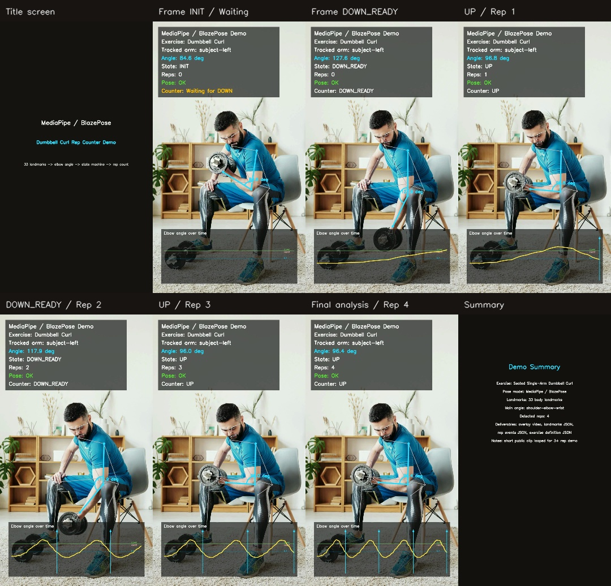

# MediaPipe Exercise Rep Counter

A modular computer vision portfolio project that converts exercise video into pose landmarks, joint-angle signals, validated repetition events, an annotated MP4, and machine-readable JSON.

The included demo analyzes a seated single-arm dumbbell curl with MediaPipe BlazePose and OpenCV. The pose model extracts 33 body landmarks; deterministic geometry and a state machine then select the active arm, track elbow flexion, reject incomplete movements, and count valid repetitions.

<p align="center">
  
</p>

## Demo Video

[Open the annotated MP4](assets/bicep_curl_overlay_v3.mp4)

The portfolio video uses a short public exercise clip looped for demonstration. The original source clip is not redistributed in this repository. Use your own or appropriately licensed video when running the pipeline.

## What This Project Demonstrates

- MediaPipe BlazePose inference and 33-landmark extraction
- Automatic active-arm selection using visibility, angle range, and wrist motion
- Shoulder-elbow-wrist angle calculation
- Exponential smoothing of the angle signal
- Adaptive threshold estimation with a static fallback
- INIT-aware repetition-counting state machine
- Minimum duration and range-of-motion validation
- Pose-quality and counter-state separation
- OpenCV video rendering with skeleton, angle arc, live timeline, and rep markers
- JSON export for landmarks, rep events, exercise definition, run metadata, and edge-case notes
- Modular Python architecture with unit-tested geometry and counting logic

## Processing Pipeline

```text
Input video
    -> loop demo clip when requested
    -> MediaPipe pose extraction
    -> left/right arm scoring
    -> elbow-angle calculation
    -> signal smoothing
    -> adaptive thresholds
    -> state-machine rep counting
    -> annotated video and JSON exports
```

## State Machine

```text
INIT -> DOWN_READY   when angle >= down_threshold
DOWN_READY -> UP     when angle <= up_threshold
UP -> DOWN_READY     when angle >= reset_threshold
```

The counter must first observe an extended arm. This prevents a false first repetition when a video starts halfway through a curl.

A repetition is accepted only when it also satisfies:

- minimum duration: `0.35 s` by default
- minimum observed angle range: `35 degrees` by default

## Repository Structure

```text
.
├── assets/                  # Portfolio preview image and annotated demo video
├── examples/                # Example output schemas
├── input/                   # Put local source video here; ignored by Git
├── src/
│   ├── config.py            # Exercise and landmark configuration
│   ├── exporters.py         # JSON and Markdown output
│   ├── geometry.py          # Angle calculation and smoothing
│   ├── pose_extractor.py    # BlazePose processing and active-arm selection
│   ├── renderer.py          # OpenCV overlays and contact sheet
│   ├── rep_counter.py       # Thresholds, state machine, and rep validation
│   └── video_utils.py       # Input discovery and video looping
├── tests/
├── run_demo.py
├── run_demo.sh
└── requirements.txt
```

## Requirements

- Python 3.10 or 3.11 recommended
- MediaPipe
- OpenCV
- NumPy
- Optional: FFmpeg for browser-friendly H.264 output

Without FFmpeg, the script keeps the MP4 generated by OpenCV.

## Installation

### Linux or macOS

```bash
python3 -m venv venv
source venv/bin/activate
python -m pip install --upgrade pip
pip install -r requirements.txt
```

### Windows PowerShell

```powershell
python -m venv venv
venv\Scripts\Activate.ps1
python -m pip install --upgrade pip
pip install -r requirements.txt
```

## Run

Place exactly one `.mp4`, `.mov`, or `.m4v` file in the repository root or in `input/`, then run:

```bash
python run_demo.py
```

Or pass the source explicitly:

```bash
python run_demo.py --input input/example.mp4 --loops 4
```

Useful options:

```bash
python run_demo.py \
  --input input/example.mp4 \
  --loops 4 \
  --alpha 0.3 \
  --min-rep-duration-sec 0.35 \
  --min-angle-range-for-valid-rep 35
```

## Generated Outputs

The default `output/` directory contains:

```text
bicep_curl_overlay_v3.mp4
bicep_curl_overlay.mp4
overlay_contact_sheet_v3.jpg
landmarks_sample.json
rep_events.json
exercise_definition.json
demo_summary.json
edge_cases.md
```

The JSON output is designed for integration with dashboards, APIs, mobile applications, exercise catalogs, and downstream analytics.

## Tests

Install the test dependency and run:

```bash
pip install pytest
pytest
```

The tests cover angle geometry, invalid vectors, exponential smoothing, counter initialization, valid repetitions, minimum duration, and minimum range-of-motion checks.

## Technical Notes

### Active-arm selection

Both arms are scored from landmark visibility, elbow-angle range, and wrist motion. This helps distinguish the working arm from a planted support arm in a concentration curl.

### Adaptive thresholds

When enough angle samples are available and the observed range is sufficient, thresholds are derived from angle percentiles. A static fallback is used for weak or incomplete signals.

### Subject-side labels

`left` and `right` follow MediaPipe anatomical landmark naming. The overlay uses `subject-left` and `subject-right` to avoid confusion with screen coordinates.

## Limitations

This repository is a portfolio prototype, not a clinically validated fitness product. The included result demonstrates the architecture and observable counting logic on a short public clip. Production validation should include multiple people, body types, camera positions, rep speeds, partial repetitions, low light, motion blur, and wrist or dumbbell occlusion.

No statistical accuracy claim is made because the project does not include a labeled evaluation dataset.

## Possible Extensions

- Multiple exercise definitions through configuration
- Real-time webcam processing
- FastAPI upload and analysis endpoint
- Form-quality feedback and error classification
- Per-user calibration
- Dataset-level evaluation metrics
- Mobile or browser visualization

## Author

[colaweb on GitHub](https://github.com/colaweb-pt)

## License

The source code is released under the MIT License. Demo media remains subject to its original source license and is included only as a transformed portfolio result.
